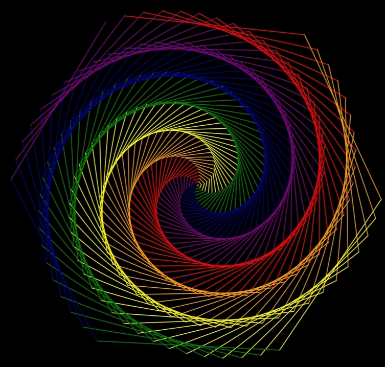

# Colorful Spiral with Python Turtle  

This project uses the Python **turtle** graphics library to draw a vibrant spiral pattern on a black background.  
By combining speed, pen width, and a cycle of rainbow colors, the program generates an eye-catching geometric artwork.  

## Features
- Draws a colorful spiral using Python turtle  
- Uses multiple colors in a repeating sequence  
- Beginner-friendly and creative project  

## Preview
Here is the result of running the program:  



## How to Run
1. Install Python (3.x)  
2. Run the script in your IDE or terminal:  
   ```bash
   python turtle_graphic_2.py
   
